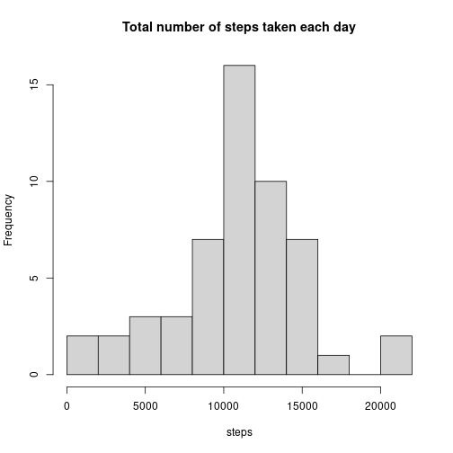
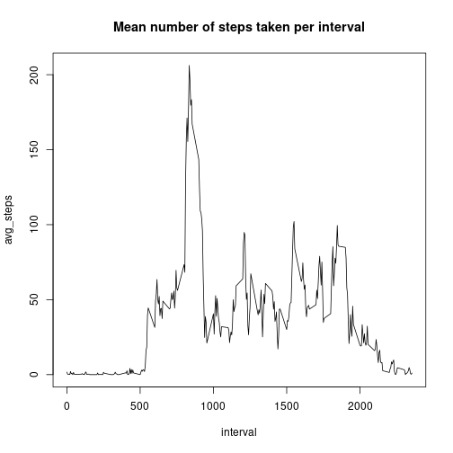
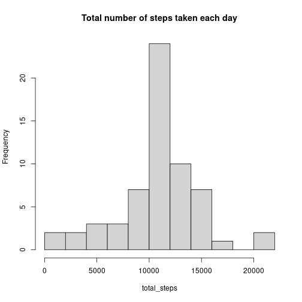
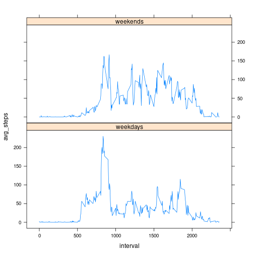
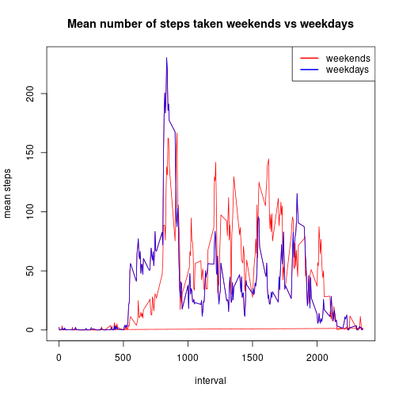

## Loading and preprocessing the data

```r
# libraries
library(data.table)
library(lattice)
library(knitr)

# 1- Code for reading in the dataset and/or processing the data
activity <- fread('/home/rstudio/Reproducible Research/week2/activity.csv')

head(activity)
```

```
##    steps       date interval
## 1:    NA 2012-10-01        0
## 2:    NA 2012-10-01        5
## 3:    NA 2012-10-01       10
## 4:    NA 2012-10-01       15
## 5:    NA 2012-10-01       20
## 6:    NA 2012-10-01       25
```


## What is mean total number of steps taken per day?

```r
# 1- Calculate the total number of steps taken per day
activity[
  !is.na(steps),
  ][
  ,.(total_steps = sum(steps)),
  by = date
  ] -> total_steps

# first five rows
total_steps[1:5]
```

```
##          date total_steps
## 1: 2012-10-02         126
## 2: 2012-10-03       11352
## 3: 2012-10-04       12116
## 4: 2012-10-05       13294
## 5: 2012-10-06       15420
```

```r
# 2- Histogram of the total number of steps taken each day
with(total_steps, 
     hist(total_steps, 
          main = 'Total number of steps taken each day', 
          xlab = 'steps', 
          breaks = 15)
     )
```



```r
# 3- Calculate and report the mean and median of the total number of steps taken 
# per day
activity[
  !is.na(steps),
         ][
           , .(avg_steps = mean(steps),
               median_steps = median(steps)
               ), by = date
           ] -> dt_steps

# first five rows
dt_steps[1:5]
```

```
##          date avg_steps median_steps
## 1: 2012-10-02   0.43750            0
## 2: 2012-10-03  39.41667            0
## 3: 2012-10-04  42.06944            0
## 4: 2012-10-05  46.15972            0
## 5: 2012-10-06  53.54167            0
```


## What is the average daily activity pattern?

```r
# Make a time series plot of the 5-minute interval (x-axis) and the average number 
# of steps taken, averaged across all days (y-axis)
activity[
  ,.(avg_steps = mean(steps, na.rm = T)),
  by = interval
  ] -> avg_interval

with(avg_interval, 
     plot(x = interval, 
          y = avg_steps, 
          type = 'l', 
          main = 'Mean number of steps taken per interval')
     )
```



```r
# Which 5-minute interval, on average across all the days in the dataset, contains the 
# maximum number of steps?
avg_interval[
  order(-avg_steps)
  ][
    1:5
  ]
```

```
##    interval avg_steps
## 1:      835  206.1698
## 2:      840  195.9245
## 3:      850  183.3962
## 4:      845  179.5660
## 5:      830  177.3019
```

The 5-minute interval **835** on average contains the the maximun number of steps

## Imputing missing values

```r
# 1- Calculate and report the total number of missing values in the dataset 
# (i.e. the total number of rows with NA)
colSums(
  is.na(activity)
)
```

```
##    steps     date interval 
##     2304        0        0
```

```r
# 2- Devise a strategy for filling in all of the missing values in the dataset. 
# The strategy does not need to be sophisticated. For example, you could use the 
# mean/median for that day, or the mean for that 5-minute interval, etc.

# 3- Create a new dataset that is equal to the original dataset but with the missing 
# data filled in
activity[
  , steps := ifelse(is.na(steps),
                    trunc(mean(steps, na.rm = TRUE)),
                    steps
                    ),
  by = interval
  ]

# 4- Make a histogram of the total number of steps taken each day and Calculate and 
# report the mean and median total number of steps taken per day. Do these values 
# differ from the estimates from the first part of the assignment? What is the impact 
# of imputing missing data on the estimates of the total daily number of steps?
activity[
  , .(total_steps = sum(steps),
      avg_steps = mean(steps),
      median_steps = median(steps)
      ),
  by = date
  ] -> activity_no_na

# first five rows
activity_no_na[1:5]
```

```
##          date total_steps avg_steps median_steps
## 1: 2012-10-01       10641  36.94792         33.5
## 2: 2012-10-02         126   0.43750          0.0
## 3: 2012-10-03       11352  39.41667          0.0
## 4: 2012-10-04       12116  42.06944          0.0
## 5: 2012-10-05       13294  46.15972          0.0
```

```r
with(activity_no_na,
     hist(x = total_steps,
          breaks = 15,
          main = 'Total number of steps taken each day')
     )
```




## Are there differences in activity patterns between weekdays and weekends?

```r
# 1- Create a new factor variable in the dataset with two levels – “weekday” and 
# “weekend” indicating whether a given date is a weekday or weekend day
activity[
  , day := {weekday = weekdays(x = as.Date(date));
  ifelse(weekday == 'Saturday' | weekday == 'Sunday',
         'weekends',
         'weekdays'
         )}
  ]

# summary of steps taken, across all weekday days or weekend
with(
  activity, 
  tapply(X = steps, INDEX = day, FUN = summary)
  )
```

```
## $weekdays
##    Min. 1st Qu.  Median    Mean 3rd Qu.    Max. 
##    0.00    0.00    0.00   35.55   24.00  806.00 
## 
## $weekends
##    Min. 1st Qu.  Median    Mean 3rd Qu.    Max. 
##    0.00    0.00    0.00   42.31   35.00  785.00
```


```r
# 2- Make a panel plot containing a time series plot of the 5-minute interval (x-axis) 
# and the average number of steps taken, averaged across all weekday days or weekend 
# days (y-axis). See the README file in the GitHub repository to see an example of 
# what this plot should look like using simulated data.
activity[
  ,.(avg_steps = mean(steps)),
  by = .(interval, day)
  ] -> dt_weekday

xyplot(avg_steps ~ interval | day,
       dt_weekday,
       type = "l",
       layout = c(1, 2)
       )
```



```r
with(
  dt_weekday,
  plot(interval, avg_steps, type="l", 
       main = 'Mean number of steps taken weekends vs weekdays', 
       ylab="mean steps", col = 'red'
       )
  )

with(
  dt_weekday[day == 'weekdays'],
  lines(interval, avg_steps, col = "blue")
  )

legend(
  "topright", col = c("red", "blue"), 
  legend = c('weekends', 'weekdays'),
  lty = 1, lwd = 2
  )
```



